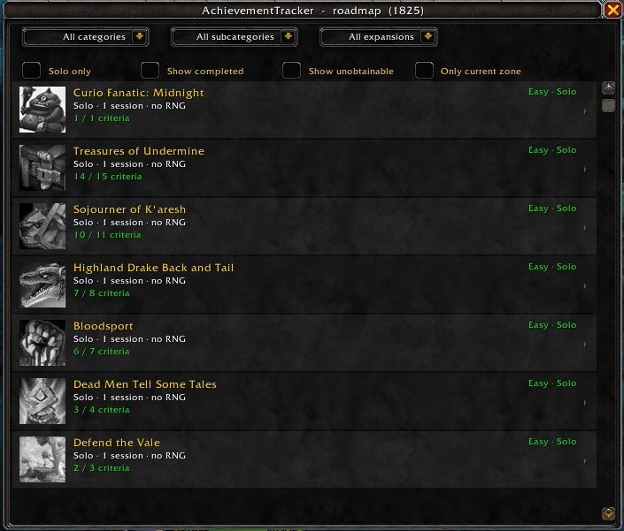
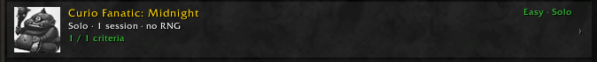
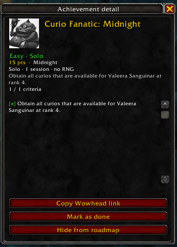
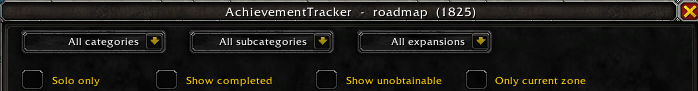
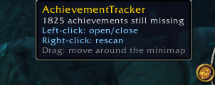

<div align="center">

# 🏆 AchievementTracker

### Um roadmap das conquistas que ainda faltam — ordenado do *fácil, dá pra fazer sozinho agora* até o *precisa de grupo ou semanas de grind*.

**Idioma:** [English](README.md) · **Português (BR)**


</div>

---

## ✨ Por que o AchievementTracker?

O jogo tem os painéis de conquista, e existem addons que listam o que falta.
**Nenhum deles ordena pelo que é realista fazer AGORA, sozinho, com pouco esforço.**

O coração do AchievementTracker não é "elegibilidade oculta" (isso é o irmão dele,
[MountTracker](https://github.com/lucas-fsousa/MountTracker)) — é a **curadoria de
dificuldade**. Para cada conquista que falta, ele responde:

1. **Dá pra fazer sozinho?** Ou precisa de grupo (dungeon, raid, zerg de world boss)?
2. **Quanto esforço/tempo?** Uma sessão? Vários dias de tarefa recorrente? Uma estação inteira?
3. **Depende de sorte (RNG)?** Spawn raro, drop, evento sazonal.
4. **Está acessível?** Conteúdo atual, conteúdo antigo solável hoje, ou inobtenível
   (Feat of Strength)?

O roadmap então mostra primeiro as **vitórias fáceis** — o que dá pra limpar rápido e
sozinho — e empurra pro fim o que exige coordenação ou maratona.

---

## 📸 Screenshots



*O roadmap — as conquistas que faltam, fácil/solo primeiro, cada uma com seu badge de tier e progresso de critérios.*

| | |
|:---:|:---:|
|  |  |
| Nome + badge de tier, a linha de dimensões e o progresso | Clique numa linha → pontos, dimensões e checklist de critérios |
|  |  |
| Filtre por categoria / subcategoria / expansão / dificuldade + toggles | Botão do minimapa — arraste e clique para abrir |

---

## 🎯 O que ele faz

- **Varre as conquistas da conta inteira** ao vivo (categorias + critérios).
- **Monta um roadmap priorizado** do que falta — mais fácil/solo primeiro.
- **Marca cada uma com um tier de dificuldade** (Easy·Solo, Medium, Grind/Long-term,
  Group, Hard/RNG, Unobtainable) derivado de um overlay curado + seu progresso ao vivo.
- **Mostra seu progresso** por conquista (X / N critérios) e o que a bloqueia (presa a
  outra conquista).
- **Filtra** por categoria, expansão, zona atual, e toggles: Solo only, Show completed,
  Show unobtainable.

---

## 🧠 Como funciona

Um **modelo híbrido**, igual ao MountTracker:

1. **Estado ao vivo da API.** O jogo responde *o que existe*, *você completou?* e o
   *progresso parcial dos critérios* — lido ao vivo toda vez.
2. **Overlay curado de dificuldade — a mágica.** Uma tabela verificada à mão (indexada
   por achievementID, alimentada lendo descrição e comentários do Wowhead) adiciona o que
   a API não dá: **é solo ou grupo, quão difícil, quanto tempo, RNG, acessibilidade**.
   Dessas dimensões sai um score; ordenar por ele coloca as vitórias fáceis solo no topo.

Conquistas sem entrada curada ainda aparecem, num tier neutro *Uncurated*, até alguém
classificá-las — a curadoria é incremental.

> Diferente das montarias, **a maior parte do valor aqui é a curadoria manual de
> dificuldade.** A API dá o esqueleto (lista, progresso); a inteligência ("isso é fácil e
> solo", "isso precisa de 5 pessoas", "isso leva semanas") é nossa.

---

## 📥 Instalação

1. Baixe o **`AchievementTracker.zip`** da última release.
   *(Não use o link "Source code (zip)" — esse não carrega no jogo.)*
2. Extraia em:
   ```
   World of Warcraft\_retail_\Interface\AddOns\
   ```
   (Você terá uma pasta `AchievementTracker` com o `AchievementTracker.toc`.)
3. Reinicie o jogo, ou `/reload` se já estava aberto.

> Mirando o **Midnight 12.0.5** (`## Interface: 120005`). Em outra build? Edite a linha
> `## Interface:` no topo do `AchievementTracker.toc`, ou marque *"Carregar addons
> desatualizados."*

---

## 🕹️ Uso

Abra a janela pelo **botão do minimapa** ou por um slash command:

| Comando | O que faz |
|---|---|
| `/achtrack` (ou `/atr`, `/achievementtracker`) | Abre / fecha a janela do roadmap |
| `/achtrack scan` | Imprime um resumo no chat (faltando / completas / inobteníveis) |
| `/achtrack find <nome>` | Descobre o ID interno de uma conquista |
| `/achtrack dump` | Exporta todas as conquistas para o SavedVariables (p/ a ferramenta de curadoria) |
| `/achtrack minimap` | Mostra / esconde o botão do minimapa |
| `/achtrack zone` | Diagnóstico do filtro de zona atual |
| `/achtrack marked` / `hidden` / `unhide <nome>` | Gerencia seus overrides manuais |
| `/achtrack reset` | Limpa seus overrides (marcadas como feitas / ocultas) |
| `/achtrack debug` | Liga/desliga detalhes técnicos de erro |
| `/achtrack help` | Lista todos os comandos |

---

## 🗺️ Status do projeto

O AchievementTracker está em **desenvolvimento ativo** e já cobre o jogo inteiro.

- [x] Scanner, modelo de dificuldade, score com carga de trabalho, ordenação do roadmap
- [x] Filtros (categoria → subcategoria, expansão, zona atual) + toggles Solo/Completas/Inobteníveis
- [x] Pré-requisitos de meta detectados automaticamente (mostra o que bloqueia, e a libera quando tudo está feito)
- [x] Overlay curado de dificuldade em **todas as categorias de topo** com conquistas faltando (1800+ entradas)
- [x] Toolkit de curadoria (raspagem educada e cacheada do Wowhead) + validador + CI/release
- [ ] Revisão manual fina de classificações específicas
- [ ] Marcar Feats of Strength realmente removidos como inobteníveis

---

## 🐎 Addon irmão — MountTracker

Curtiu a ideia do roadmap-de-conquistas? O irmão dele faz o mesmo para **montarias**:

### 👉 [**MountTracker**](https://github.com/lucas-fsousa/MountTracker) — seu roadmap pessoal de coleção de montarias

Mesma facilidade, voltada para a sua coleção de montarias: cruza sua reputação, renome,
moedas e conquistas ao vivo contra cada montaria que você não tem e **acende as que você
já pode pegar agora**, depois monta um roadmap do resto — mais fácil primeiro — com o
vendedor, local e custo exatos. Zero dependências, mesma interface limpa. Pegue aqui:
**https://github.com/lucas-fsousa/MountTracker**

---

## 📜 Licença

Lançado sob a **Licença MIT** — livre para usar, estudar e melhorar. Veja `LICENSE`.

> _World of Warcraft e os ativos relacionados são marcas da Blizzard Entertainment. Este
> é um addon não-oficial, feito por fã._

---

<div align="center">

Feito para a comunidade caçadora de conquistas do WoW.
**Boa caçada**

</div>
